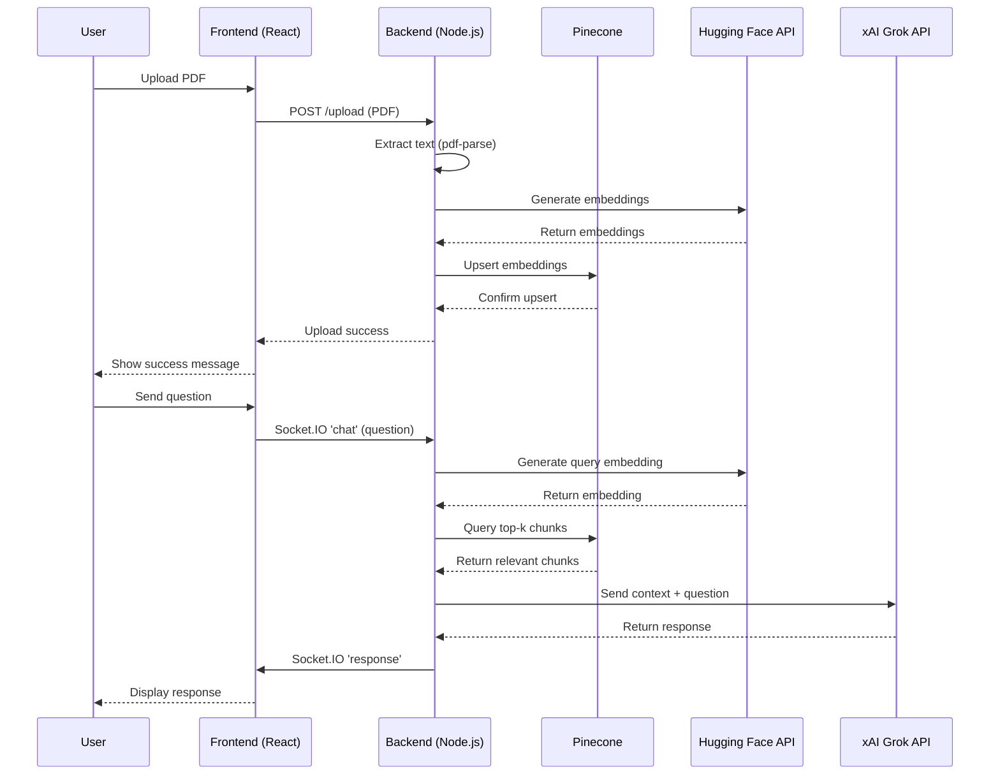

# Real-Time AI Chatbot with RAG: Architecture Overview

This document outlines the architecture for a **Real-Time AI Chatbot with Retrieval-Augmented Generation (RAG)**, designed to allow users to upload documents (e.g., PDFs) and ask questions answered using document context. The architecture is optimized for a 1–2 week development timeline, focusing on simplicity, functionality, and core RAG capabilities.

---

## Architecture Components

### 1. Frontend (React)

- **Purpose**: User interface for file uploads, real-time chat, and response display.
- **Components**:
  - **File Upload**: Input field for PDF uploads, using `FormData` for backend communication.
  - **Chat Interface**: Conversational UI for user messages and bot responses, styled with CSS.
  - **Real-Time Messaging**: Socket.IO client for sending queries and receiving responses.
- **Tech**: React, Socket.IO-client, Axios, CSS.
- **Features**:
  - File upload button (drag-and-drop optional).
  - Scrollable chat window with message history.
  - Input field and "Send" button for questions.
- **Time Estimate**: 3–4 days.

### 2. Backend (Node.js + Express + Socket.IO)

- **Purpose**: Manages file processing, document embedding, real-time communication, and LLM integration.
- **Components**:
  - **File Processing**: Extracts text from PDFs using `pdf-parse`.
  - **Embedding Generation**: Converts text to vector embeddings via Hugging Face’s `sentence-transformers` API.
  - **Vector Storage**: Stores embeddings in Pinecone for retrieval.
  - **Query Processing**:
    - Converts user queries to embeddings.
    - Retrieves relevant document chunks from Pinecone via similarity search.
    - Combines chunks with query and sends to LLM (e.g., xAI Grok API) for response generation.
  - **Real-Time Communication**: Socket.IO for live chat.
- **Tech**: Node.js, Express, Socket.IO, `pdf-parse`, Pinecone, Axios.
- **Features**:
  - REST endpoint (`/upload`) for PDF uploads.
  - Socket.IO events (`chat`, `response`) for query-response flow.
  - Pinecone integration for vector storage/retrieval.
  - LLM API for contextual answers.
- **Time Estimate**: 5–7 days.

### 3. Database (Pinecone)

- **Purpose**: Stores document embeddings for scalable retrieval.
- **Setup**:
  - Create Pinecone index (`docs`) for vectors.
  - Upsert embeddings with metadata (e.g., text, IDs).
  - Query index with user question embeddings for top-k chunks.
- **Tech**: Pinecone (vector database).
- **Features**:
  - Stores document embeddings.
  - Supports similarity search for RAG context.
- **Time Estimate**: 1–2 days.

### 4. External APIs

- **Hugging Face API**: Generates embeddings for documents and queries.
- **xAI Grok API** (or alternative LLM): Generates responses based on document chunks and queries.
- **Tech**: Axios for API requests.
- **Time Estimate**: 1 day.

### 5. Deployment (Optional)

- **Purpose**: Host application for public access.
- **Setup**:
  - Backend: Render or Heroku.
  - Frontend: Vercel or Netlify.
  - Configure environment variables for API keys.
- **Time Estimate**: 1–2 days (if included).

---

## Data Flow

1. **Document Upload**:
   - Frontend sends PDF to backend (`/upload`).
   - Backend extracts text (`pdf-parse`), generates embeddings (Hugging Face API), and stores in Pinecone.
2. **User Query**:
   - Frontend sends query via Socket.IO (`chat`).
   - Backend converts query to embedding, queries Pinecone, and sends context + query to LLM.
   - LLM response sent to frontend via Socket.IO (`response`).
3. **Real-Time Display**:
   - Frontend updates chat UI with query and response.

---

## Architecture Diagram

---

## Sequence Diagram

Below is a sequence diagram depicting the interactions for document upload and query processing, using Mermaid syntax.

---

## Development Plan (1–2 Weeks)

- **Week 1**:
  - **Day 1–2**: Backend setup (Node.js, Express, Socket.IO), integrate `pdf-parse`.
  - **Day 3–4**: Configure Pinecone and Hugging Face API for embeddings.
  - **Day 5**: Build frontend (React) with file upload and chat UI.
- **Week 2**:
  - **Day 6–7**: Integrate Socket.IO for real-time chat and LLM API.
  - **Day 8–9**: Test end-to-end flow, polish UI with CSS.
  - **Day 10**: (Optional) Deploy to cloud, finalize documentation.
  - **Buffer**: 1–2 days for debugging/testing.

---

## Simplifications for Timeline

- Support only PDFs (exclude TXT, DOCX).
- Use Hugging Face’s hosted API instead of local `sentence-transformers`.
- Implement basic RAG (skip query expansion).
- Focus on functional UI (skip animations, drag-and-drop).
- Use xAI Grok API for LLM (see https://x.ai/api for access).
- Defer deployment to post-MVP if time-constrained.

---

## CV Highlights

- **Technologies**: Node.js, Express, React, Socket.IO, Pinecone, Hugging Face API, xAI Grok API.
- **Skills**: RAG, vector databases, real-time systems, document processing, API integration.
- **Impact**: Built a 2025-trending AI chatbot with RAG, showcasing advanced AI expertise.
