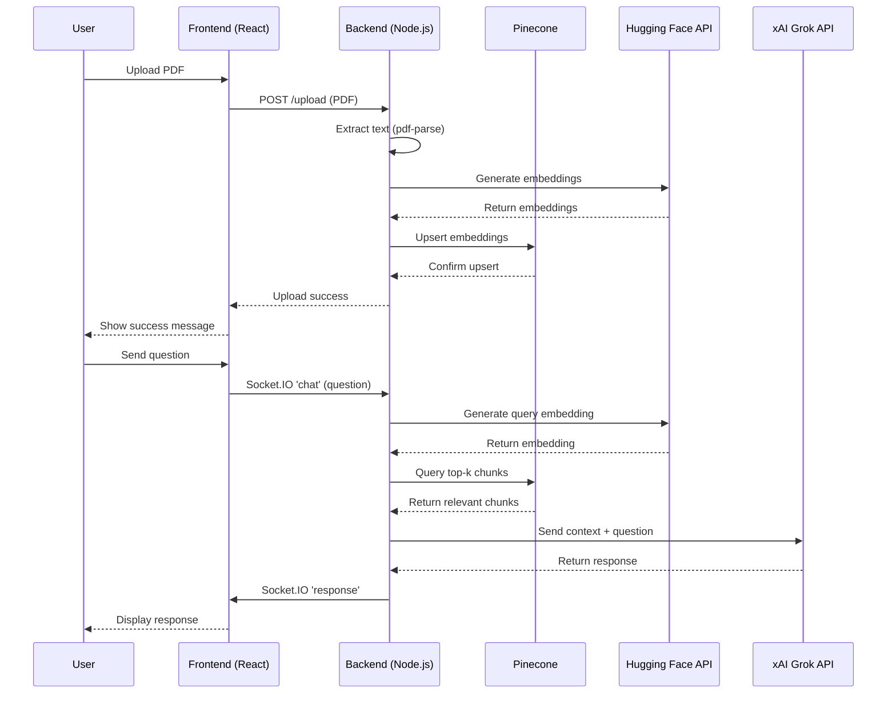

# Real-Time AI Chatbot with RAG: Architecture Overview

## Sequence Diagram

Below is a sequence diagram depicting the interactions for document upload and query processing, using Mermaid syntax.

---
