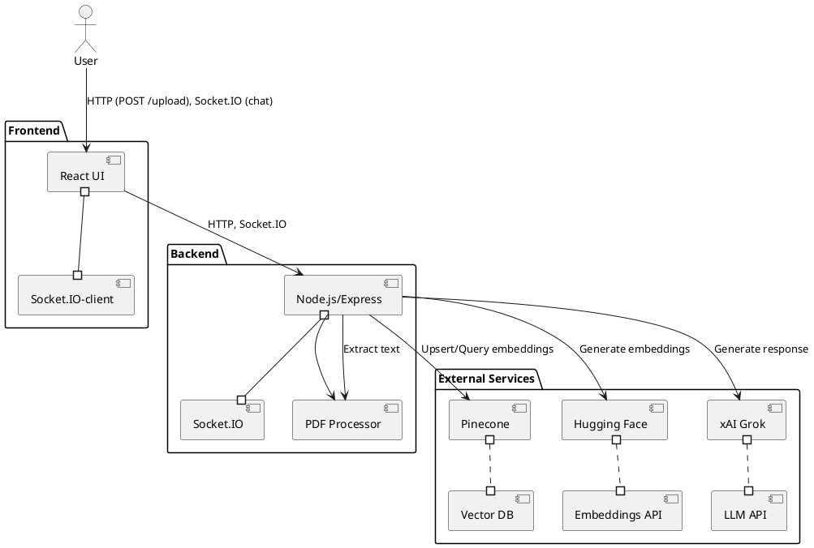

# Real-Time AI Chatbot Architecture Diagram

This document contains the PlantUML code for the architecture diagram of the Real-Time AI Chatbot with Retrieval-Augmented Generation (RAG).

## PlantUML Diagram

## Rendering Instructions

- **Online**: Copy the PlantUML code into an online editor like [plantuml.com](http://plantuml.com) to render the diagram.
- **VS Code**: Install the PlantUML extension, save this file as `architecture_diagram.puml`, and preview the diagram.
- **Command Line**: Install PlantUML, save the code as `architecture_diagram.puml`, and run `plantuml architecture_diagram.puml` to generate an image (e.g., PNG).
