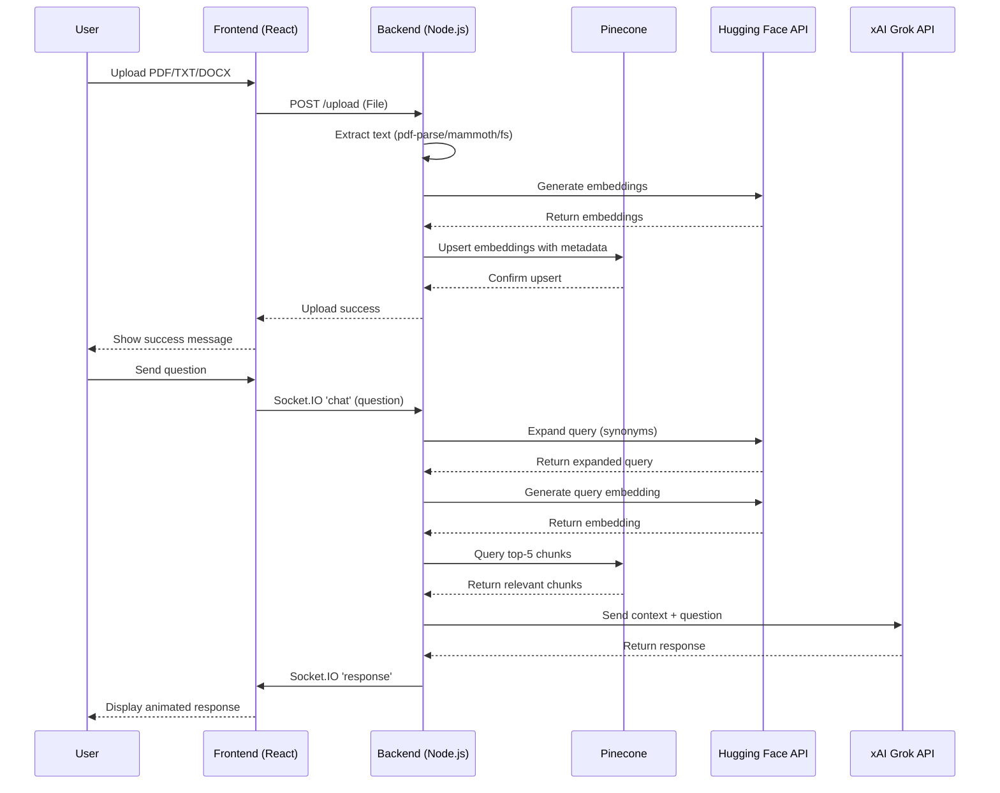

# Real-Time AI Chatbot with RAG: Sprint 1 Architecture Overview

This document outlines the updated architecture for Sprint 1 of the **Real-Time AI Chatbot with Retrieval-Augmented Generation (RAG)**. It builds on Sprint 0, adding multi-file support, advanced RAG techniques, UI/UX enhancements, and optimized performance. The architecture is designed for a 1–2 week development timeline, balancing new features with maintainability and CV impact.

---

## Changelog (Sprint 0 to Sprint 1)

- **Added**: Support for TXT and DOCX file types alongside PDFs.
- **Added**: Query expansion for improved RAG retrieval accuracy.
- **Added**: Drag-and-drop file upload and chat message animations in the frontend.
- **Improved**: Optimized text chunking and embedding storage in Pinecone.
- **Improved**: Documentation with version control and changelog for maintainability.
- **Planned**: Cloud deployment setup with environment variable management.

---

## Architecture Components

### 1. Frontend (React)

- **Purpose**: Enhanced user interface for multi-file uploads, real-time chat, and dynamic response display.
- **Components**:
  - **File Upload**: Input field with drag-and-drop support for PDFs, TXT, and DOCX files, using `FormData`.
  - **Chat Interface**: Conversational UI with animated message transitions and scrollable history.
  - **Real-Time Messaging**: Socket.IO client for bidirectional query-response communication.
- **Tech**: React, Socket.IO-client, Axios, Tailwind CSS (replacing basic CSS for faster styling).
- **Features**:
  - Drag-and-drop file upload with multi-file type validation.
  - Animated chat messages (e.g., fade-in for new messages).
  - Responsive chat window with user/bot message styling.
- **Time Estimate**: 4–5 days.

### 2. Backend (Node.js + Express + Socket.IO)

- **Purpose**: Handles multi-file processing, advanced embedding generation, real-time communication, and LLM integration.
- **Components**:
  - **File Processing**:
    - PDFs: Extract text using `pdf-parse`.
    - TXT: Read directly using `fs` (Node.js).
    - DOCX: Extract text using `mammoth` library.
  - **Embedding Generation**: Generates embeddings with Hugging Face’s `BAAI/bge-small-en-v1.5` model, optimized for multi-chunk processing.
  - **Query Expansion**: Expands user queries with synonyms or related terms (via Hugging Face API or local word embeddings) before embedding.
  - **Vector Storage**: Stores optimized embeddings in Pinecone with metadata (e.g., file type, text snippet).
  - **Query Processing**:
    - Expands query, converts to embedding, and retrieves top-k chunks from Pinecone.
    - Combines chunks with query and sends to xAI Grok API for response generation.
  - **Real-Time Communication**: Socket.IO for live chat with error handling.
- **Tech**: Node.js, Express, Socket.IO, `pdf-parse`, `mammoth`, Pinecone, Axios.
- **Features**:
  - REST endpoint (`/upload`) for multi-file uploads with validation.
  - Socket.IO events (`chat`, `response`) with query expansion logic.
  - Optimized chunking (e.g., overlap size of 100 characters, max chunk size of 512).
  - Pinecone upsert with metadata for file type and source tracking.
- **Time Estimate**: 6–8 days.

### 3. Database (Pinecone)

- **Purpose**: Stores document embeddings for efficient retrieval with metadata enhancements.
- **Setup**:
  - Use existing Pinecone index (`docs`) with 384 dimensions.
  - Upsert embeddings with metadata (e.g., `fileType: "pdf"`, `text: snippet`, `source: filename`).
  - Query index with expanded query embeddings for top-5 chunks.
- **Tech**: Pinecone (vector database).
- **Features**:
  - Enhanced metadata for better traceability (e.g., file type, source).
  - Optimized storage to reduce upsert latency.
- **Time Estimate**: 1–2 days.

### 4. External APIs

- **Hugging Face API**: Generates embeddings for documents and queries; supports query expansion via text augmentation.
- **xAI Grok API**: Generates responses using context from Pinecone chunks (see https://x.ai/api for access).
- **Tech**: Axios for API requests with timeout handling.
- **Time Estimate**: 1 day.

### 5. Deployment

- **Purpose**: Host application for public access and portfolio showcasing.
- **Setup**:
  - Backend: Deploy on Render with Node.js environment.
  - Frontend: Deploy on Vercel for React app.
  - Configure `.env` files for API keys (Hugging Face, Pinecone, xAI).
  - Set up CORS for cross-origin requests between frontend and backend.
- **Tech**: Render, Vercel, dotenv.
- **Time Estimate**: 2–3 days.

---

## Data Flow

1. **Document Upload**:
   - Frontend sends PDF, TXT, or DOCX to backend (`/upload`).
   - Backend extracts text (`pdf-parse`, `mammoth`, or `fs`), splits into optimized chunks, generates embeddings (Hugging Face API), and upserts to Pinecone with metadata.
2. **User Query**:
   - Frontend sends query via Socket.IO (`chat`).
   - Backend expands query (e.g., adds synonyms), converts to embedding, queries Pinecone for top-5 chunks, and sends context + query to xAI Grok API.
   - Response sent to frontend via Socket.IO (`response`) with animation trigger.
3. **Real-Time Display**:
   - Frontend updates chat UI with animated query and response display.

---

## Architecture Diagram

The architecture remains similar to Sprint 0 but includes multi-file processing and query expansion. Below is an updated PlantUML diagram.

```
@startuml class
skinparam monochrome true
skinparam defaultFontSize 14

class User as "User (Browser/App)"
class Frontend as "Frontend\n(React, Socket.IO-client)\n- File Upload (Drag-and-Drop)\n- Real-Time Chat"
class Backend as "Backend\n(Node.js, Express, Socket.IO)\n- File Processing (PDF/TXT/DOCX)\n- Embedding Gen\n- Query Expansion\n- Response Gen"
class ExternalServices as "External Services"
class Pinecone as "Pinecone\n(Vector DB)"
class HuggingFace as "Hugging Face\n(Embeddings, Query Expansion)"
class xAIGrok as "xAI Grok API\n(LLM)"

User -down-> Frontend : HTTP (File Upload: POST /upload)\nSocket.IO (Chat: 'chat' event)
Frontend <--> Backend : HTTP/Socket.IO
Backend <--> ExternalServices : External API Calls
ExternalServices <--> Pinecone : (Vector Storage)
ExternalServices <--> HuggingFace : (Embeddings, Query Expansion)
ExternalServices <--> xAIGrok : (Response Generation)

note right of Frontend
  - Drag-and-Drop File Upload (PDF/TXT/DOCX)
  - Real-Time Chat with Animations
end note

note right of Backend
  - File Processing: pdf-parse, mammoth, fs
  - Query Expansion via Hugging Face
  - Optimized Chunking (Overlap: 100, Max: 512)
end note

note right of ExternalServices
  - API Integration for Embeddings, Expansion, and LLM
end note

@enduml
```


---

## Sequence Diagram

The sequence diagram is updated to reflect multi-file processing and query expansion, using Mermaid syntax.




---

## Development Plan (1–2 Weeks)

- **Week 1**:
  - **Day 1–2**: Update backend to support TXT (`fs`) and DOCX (`mammoth`) processing.
  - **Day 3–4**: Implement query expansion in backend using Hugging Face API.
  - **Day 5**: Optimize chunking logic (e.g., overlap size, metadata enhancements).
- **Week 2**:
  - **Day 6–7**: Enhance frontend with drag-and-drop upload and Tailwind CSS.
  - **Day 8**: Add chat animations (e.g., fade-in effects) using CSS transitions.
  - **Day 9–10**: Deploy to Render (backend) and Vercel (frontend), configure CORS and environment variables.
  - **Buffer**: 1–2 days for testing and debugging.

---

## Sprint 1 Requirements

- **Must-Have**:
  - Support for PDF, TXT, and DOCX uploads.
  - Query expansion for improved RAG accuracy.
  - Drag-and-drop file upload in frontend.
  - Chat message animations (e.g., fade-in).
  - Optimized chunking and Pinecone metadata.
- **Nice-to-Have**:
  - Basic error handling for invalid file types.
  - Cloud deployment with scalability testing.
- **Out of Scope**:
  - Local `sentence-transformers` model (use Hugging Face API).
  - Advanced UI features (e.g., voice input).

---

## CV Highlights

- **Technologies**: Node.js, Express, React, Socket.IO, Pinecone, Hugging Face API, xAI Grok API, `mammoth`, Tailwind CSS.
- **Skills**: Advanced RAG (query expansion), multi-file processing, vector databases, real-time systems, UI/UX design.
- **Impact**: Enhanced a 2025-trending AI chatbot with multi-file support and advanced RAG, demonstrating expertise in scalable AI applications.
- **Documentation**: Implemented versioned documentation with changelog, showcasing maintainability best practices.

---

## Documentation Best Practices

- **Version Control**: Store docs in a Git repository with clear commit messages (e.g., “Add Sprint 1 architecture with multi-file support”).
- **Changelog**: Maintain a changelog section to track updates from Sprint 0 to Sprint 1.
- **Clarity**: Use consistent formatting (e.g., Markdown, diagrams) for stakeholder readability.
- **LinkedIn Post Idea**: “Improved my AI chatbot’s documentation in Sprint 1 by adding a changelog and version control, ensuring maintainability while scaling features like multi-file support and advanced RAG. #AI #SoftwareEngineering”
